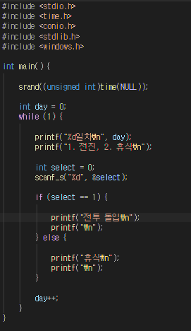
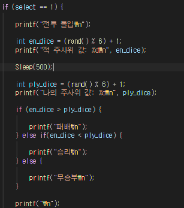
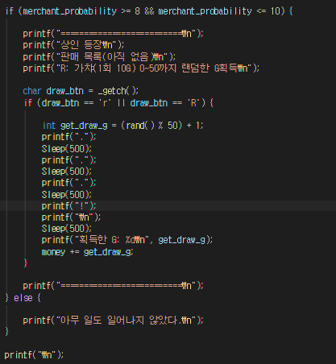
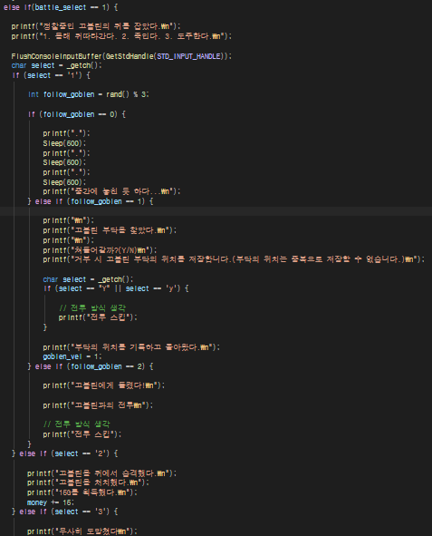
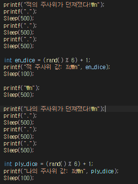
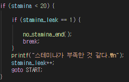
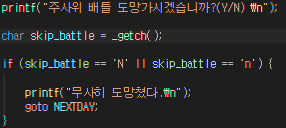

 Toy Project1, TextRPG

궁극 목표: 뭐든 완성하기

## 1일차

### 오늘의 목표
- 선택지 2개 생성
    - 여행을 떠난다.
    - 휴식한다.
- 여행을 떠날 시 전투가 발생한다.
    - 전투 시작 시 1~6 사이의 랜덤한 값 두 개를 뽑아 하나는 플레이어 하나는 적에게 준다.
        - 플레이어의 숫자가 더 높을 시 승리한다.
- 휴식을 취할 시 아무 이벤트가 일어나지 않고 일차가 늘어난다.
해보고 할 만 하면 더 추가

### 개발 단계
  
간단한 밑작업 시작
- if-else
- 선택지
- 일수 증가

  
필요한 난수값 적의 주사위 값 생성, 아군 주사위 값 생성 후 비교하여 승/패/무를 판가름함

목표치 달성

#### 컨텐츠 추가
소지금 추가  
기본 소지금 100  
승리 시 +10  
패배 시 -10  
무승부 -  

소지금이 0미만일 시 파산 엔딩

상인 추가  
  
아직 가챠 시스템만 존재

스테미나 시스템 도입, 스테미나가 부족할 때 전투에 들어갈 시 엔딩

  
정찰중인 고블린을 발견하고 3가지 선택지 중 하나를 선택하여 싸울 수 있도록 함

#### 편의성 추가
'_getch'를 사용하여 엔터 입력 없이 바로 진행 가능하도록 변경  

주사위가 던져졌다는 대사와 '...'대사 출력으로 지나치게 빠른 진행 저지(Sleep 사용)

  
스테미나가 고갈되었을 시 바로 엔딩이 아닌 1회 경고 후 2회차에 사망 판정

  
배틀이 시작되기 전, 도망가는 시스템 구축