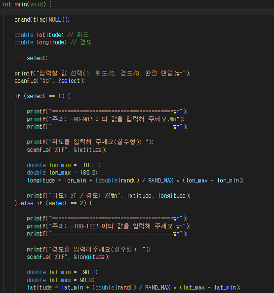
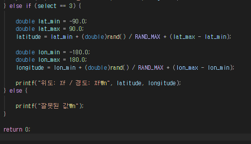
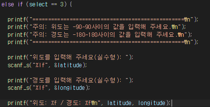
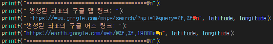
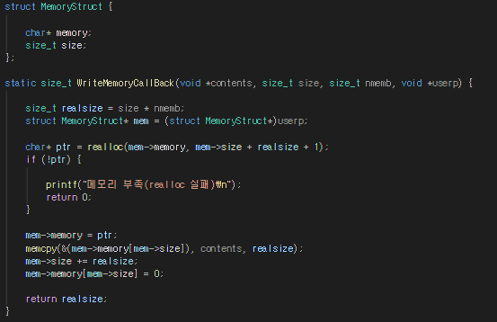
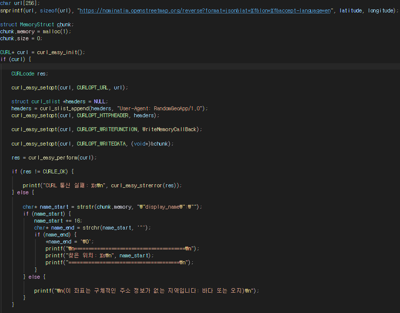
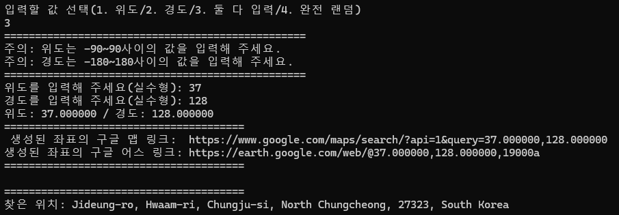
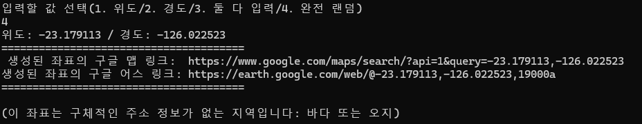

# Toy Project2, Random Point

궁극 목표: 뭐든 완성하기

## 1일차
목표: 오늘 안에 완성하기

### 만들 것
1. 입력할 값을 선택하도록 한다.
    - 위도만 입력할 지
    - 경도만 입력할 지
    - 둘 다 입력할 지
    - 완전히 랜덤하게 할 지
2. 해당 좌표값에 해당하는 곳의 정보를 매우 간략하게 설명한다.
    - ex) 산, 바다/프랑스 파리, 대한민국 서울 등
3. 검색된 좌표의 구글 어스/구글 맵 등의 URL을 표시한다.

### 작업 시작
시작하기 전에, 웹에 접근하기 위한 간단한 사전 작업이 필요하다.

외부 라이브러리를 추가해야 웹에 접근할 수 있다. 귀찮으니 대강 설명하면
1. curl 배포 공식 사이트 접속 후 나의 상황에 맞는(win x64) 파일을 설치
2. 다운로드된 압축 파일의 압축을 푼 후 프로젝트 폴더에 삽입
3. bin파일 속 '~.dll'파일을 복사 후 프로젝트 최상위 파일에 붙여넣기 한다.
    - 이거 안 하면 빌드 오류
4. 프로젝트 속성에서 외부 라이브러리 추가
짜잔 끝

*참고*  
프로젝트 순서
1. 밑작업(난수 세팅, 변수 추가 등)
2. 생성된 죄표로 검색된 구글 어스/맵의 url 노출
3. 해당 좌표에 해당하는 곳의 정보를 간략하게 설명하는 글 추가
4. 그 때 가서 만들고 싶은 게 생기면 만들기

#### 작업 1, 밑작업

  
밑 작업 일부분, 영어를 못하기에 나중에 알아볼 수 있도록 위도, 경도 표시  
- 사용자의 입력 시 오차가 없도록 경고문 표시  
- 난수의 최댓값 최솟값 범위를 정의 후 그 사이에서 난수값이 나오도록 설정
- 일단 확인하기 위해 위도 경도가 출력되도록 함(필요하다 싶으면 지우지 않을 예정)

  
- 잘못된 입력이 있을 시 받을 else문
- 선택지 3, 완전 랜덤 추가

  
- 까먹었던 둘 다 입력받는 경우까지 생성

#### 작업 2, URL 출력

사실 URL 출력은 밑작업에 들어가도 별 문제는 없을 정도로 쉽다  
  
모든 경우의 수에 저 코드를 추가하면 된다.  

## 2일차

#### 작업 3, 정보 출력

가장 귀찮고 힘든 작업의 시작, 일단 curl을 사용하기 위한 기초 작업 부터 들어가야 한다.  
  
main함수 밖, 구조체로 메모리와 크기를 선언하여 주고 메모리 할당, 메모리 정리 등등을 만들어 준다.

  
주저리주저리 길게 막 써져 있지만, 위치 좌표를 역지오코딩인가? 그거를 해주는 사이트랑 연결해서 좌표를 주고 위치 정보를 받아오는 방식이다. 그래서 위에서 선언한 구조체도 사용해 주며, JSON으로 데이터를 받아와 그것을 바탕으로 내용을 긁어 정리한다.

## 결과

  
아무쪼록 깔끔하게 정리된 모습(한글로 출력하려니 언어가 깨져서 영어로 타협)

  
랜덤을 돌리면 100에 한 번 정보가 나올까 말까 하다.

## study

### 구조체
서로 다른 자료형의 변수들을 하나로 묶어 새로운 사용자 정의 자료형을 만드는 기능  

*모습*
```
struct s1 {

    int age;
    char name[20];
};
```

구조체는 어떤 데이터들의 틀을 묶어 둔 것이지 데이터를 직접적으로 저장하는 역할을 하지 않음. 즉 구조체는 큰 틀이며 사용하기 위해서는 새로운 인스턴스와 값을 생성해 줄 필요가 있음

*구조체를 사용하는 방법(데이터 삽입)*
```
(위 구조체와 동일)
void main(void) {

    sturct s1 student1 = {18, "홍길동"};
    sturct s1 student2 = {.name = "김길동"};
}
```
위와 같이 데이터를 이름을 명명하고 데이터를 삽입하여 실질적인 객체를 생성한다.  
* typedef를 사용하지 않은 구조체라면 인스턴스를 하나 만들 때 마다 'sturct'를 필수적으로 붙여주어야 한다.

---

이번에는 typedef를 사용한 구조체 선언과 객체 생성에 대하여 생성해 볼 것이다.  

*모습*
```
struct typedef {

    int age;
    char name[20];
} s1;
```
이전보다 타이핑만 더 하고 딱히 바뀐게 없는데 이걸 왜 쓰냐 싶을 수도 있지만 인스턴스 생성 과정을 보면 꽤 나쁘지는 않다.

```
(위 구조체와 동일)
void main(void) {

    s1 student1 = {18, "홍"};
    s1 studnet2 = {.age = 17};
}
```
이런 식으로 별 것 아닌 것 같지만 인스턴스를 하나 생성할 때 마다 'sturct'를 붙이지 않아도 된다는 이점이 있다.

* typedef란?
    - typedef, 타입 정의(Type Definition)의 줄임말
    - 기존 자료형에 내가 원하는 새로운 별명을 지어주는 명령어
*예시*
```
typedef int 정수;

void main() {

    int a = 10;
    정수 b = 20;
}
```